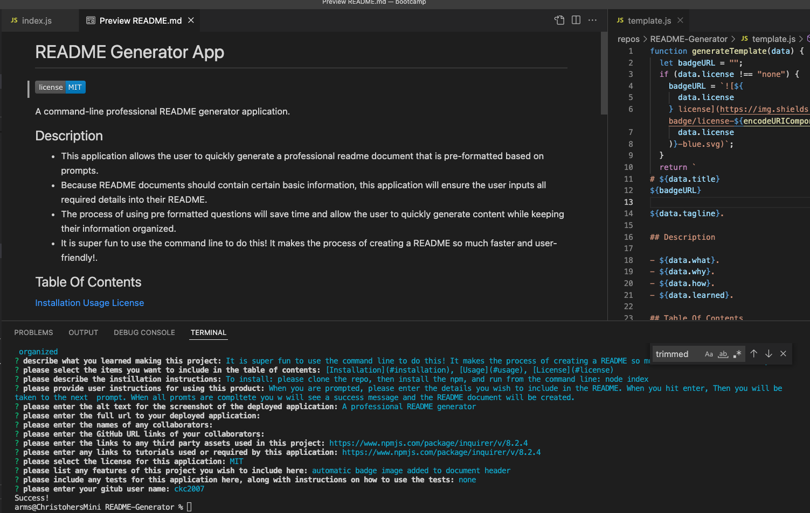

# README Generator App

A command-line professional README generator application.

## Description

- This application allows the user to quickly generate a professional README document that is pre-formatted based on prompts. 
- Because README documents should contain certain basic information, this application will ensure the user inputs all required details into their README. 
- The process of using pre formatted questions will save time and allow the user to quickly generate content while keeping their information organized. 
- It is super fun to use the command line to do this! It makes the process of creating a README so much faster and user-friendly!

## Table Of Contents

[Installation](#installation)
[Usage](#usage)
[License](#license)

## Installation

To install: please clone the repo, then install the npm, and run from the command line: node index

## Usage

When you are prompted, please enter the details you wish to include in the README. When you hit enter, Then you will be taken to the next prompt. WHen all prompts are complete you will see a success message and the README document will be created!

## Screenshot / Video

Video link: [https://drive.google.com/file/d/13mnfcxOWvMHOxH-T1x_WRevai3fuz_BN/view]

## Contributing

Third party assets used in this project include:
https://www.npmjs.com/package/inquirer/v/8.2.4

Tutorials used in this project include:
https://www.npmjs.com/package/inquirer/v/8.2.4

## License

This project is licensed under the MIT license.

## Features

automatic badge image added to document header

## Tests

none

## Questions

Please direct questions to the owner of this repository at ckc2007@gmail.com

Owner GitHub page:
[ckc2007](
https://github.com/ckc2007).
